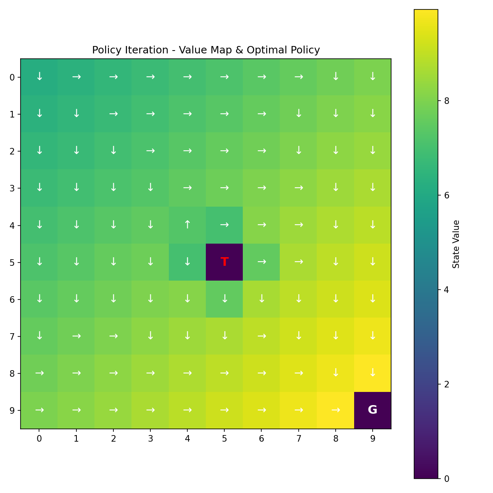

# ❄️ Icy Robot Maze — Value Iteration & Policy Iteration

A from-scratch implementation of a stochastic Grid-World MDP, solved two ways: **vectorized Value Iteration** and **vectorized Policy Iteration** (via exact linear-system solving). Built as a Week 1 Reinforcement Learning assignment.

## Overview

A robot stands on a 10×10 icy grid. It must reach a **Goal** tile (bottom-right) while avoiding a **Trap** tile (center), but the floor is slippery: any commanded move only succeeds 85% of the time, with a 5% chance of slipping into each of the other three directions.

The goal is to compute:
- A **Value Map** — how good is it to stand on any given tile?
- An **Action Map** — the safest, fastest direction to move from any tile?

Both are solved using classic Dynamic Programming, without a single simulated episode.

## Environment

| Property | Detail |
|---|---|
| Grid size | 10 × 10 (100 states) |
| Actions | Up, Down, Left, Right |
| Goal | state 99 (bottom-right), reward **+10**, absorbing |
| Trap | state 55 (center), reward **−10**, absorbing |
| Step cost | **−0.1** per move |
| Transition dynamics | 85% intended direction, 5% each unintended direction |
| Discount factor (γ) | 0.99 |

## Algorithms

**Value Iteration** — repeatedly applies the Bellman optimality update to every state simultaneously using a single `np.tensordot` call (no nested loops), until values stop changing by more than `θ = 1e-8`.

```python
Q = R + gamma * np.tensordot(P, V, axes=(2, 0))
V_new = np.max(Q, axis=1)
```

**Policy Iteration** — alternates between:
1. **Policy Evaluation**: solving the linear system `(I − γP_π) V = R_π` exactly with `scipy.linalg.solve`
2. **Policy Improvement**: greedily updating the policy from the freshly solved values

until the policy stops changing.

## Results

| Metric | Value Iteration | Policy Iteration |
|---|---|---|
| Converged in | 61 iterations | 4 steps |
| Value of start state (0) | 6.195 | 6.195 |
| Optimal policy agreement | 97 / 100 tiles (remaining 3 are exact value ties) |

<p align="center">
  
  
</p>

Both algorithms converge to numerically identical value functions, confirming the implementation is correct — Value Iteration and Policy Iteration are guaranteed to find the same optimal policy for a well-posed MDP.

## Getting Started

### Requirements
```bash
pip install numpy scipy matplotlib
```

### Run
```bash
python gridworld.py
```

This will train both solvers, print convergence stats, and export `value_iteration_map.png` and `policy_iteration_map.png` showing the value heatmap with directional policy arrows overlaid.

## Project Structure
```
.
├── gridworld.py    # BeginnerGridWorld class + solvers + plotting
├── assets/         # exported value/policy map images
└── README.md
```

## Key Implementation Details

- **State flattening**: `(row, col) → row * width + col` and back, so the MDP can be represented with flat NumPy arrays instead of 2D coordinate bookkeeping.
- **Transition tensor `P`**: shape `(100, 4, 100)` — `P[s, a, s']` is the probability of landing in `s'` after taking action `a` in state `s`. Wall collisions keep the robot in place; terminal states are absorbing.
- **Reward table `R`**: shape `(100, 4)`, precomputed as the expected reward of taking action `a` in state `s` given the transition probabilities.
- **No nested loops in the hot path**: both the Value Iteration update and the Policy Iteration improvement step use `np.tensordot` to update all 100 states × 4 actions in one vectorized operation.

## Self-Check

- ✅ No nested `for` loops inside the Value Iteration state-update block
- ✅ `solve_policy_iteration` uses `scipy.linalg.solve` for exact policy evaluation
- ✅ Exports grid plots with directional arrows for both solved value maps

## License

MIT — free to use for learning and coursework.
